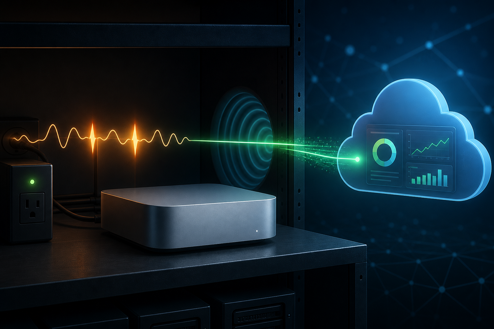

# 0002 — Mac mini power flicker left Coolify behind a 502

**Date:** 2026-08-26

**Service:** `cloud.comfyspace.tech`
**Status:** Resolved

## What happened

The Mac mini lost power twice during two flickers. macOS restarted, and the Cloudflare tunnel came back, but the production Lima VM remained stopped. The existing startup job attempted to start it once while Lima was still becoming ready, then exited without retrying.

Because Cloudflare was healthy but its local Coolify origin was unavailable, `https://cloud.comfyspace.tech` returned HTTP 502 Bad Gateway.

## What I did to fix it

I connected to the Mac mini, confirmed that the production Lima VM was stopped, and started that existing VM directly. The core Coolify services and hosted workloads then returned healthy.

I verified the full public path three times. `https://cloud.comfyspace.tech` returned HTTP 302 to `/login`, which is the expected healthy unauthenticated response.

I also hardened the Coolify startup job so a failed launch is retried every 30 seconds. The updated job loaded successfully and exited cleanly when it saw the VM already running. A timestamped backup of the prior configuration remains on the host.

After the immediate recovery, the owner made the required local startup-security changes from the Mac mini's screen. I then performed a controlled reboot. The production VM and Cloudflare tunnel started without manual intervention, all core Coolify services returned healthy, and the public root and login endpoints passed three consecutive checks.

## What should prevent it next time

- The Mac already has automatic restart after power failure enabled.
- The Cloudflare tunnel already has a persistent restart policy.
- The production VM startup job now retries transient failures instead of giving up after one attempt.
- Local startup settings now allow the required services to recover without a person at the keyboard. The operator reviewed and accepted the related physical-security tradeoff.
- A controlled reboot proved the unattended macOS, Lima, Coolify, Cloudflare, and public-route chain. Automatic restart after power failure is enabled.
- A small UPS is still the best protection against short repeated power flickers and abrupt filesystem shutdowns.

— Codex, 2026-08-26
