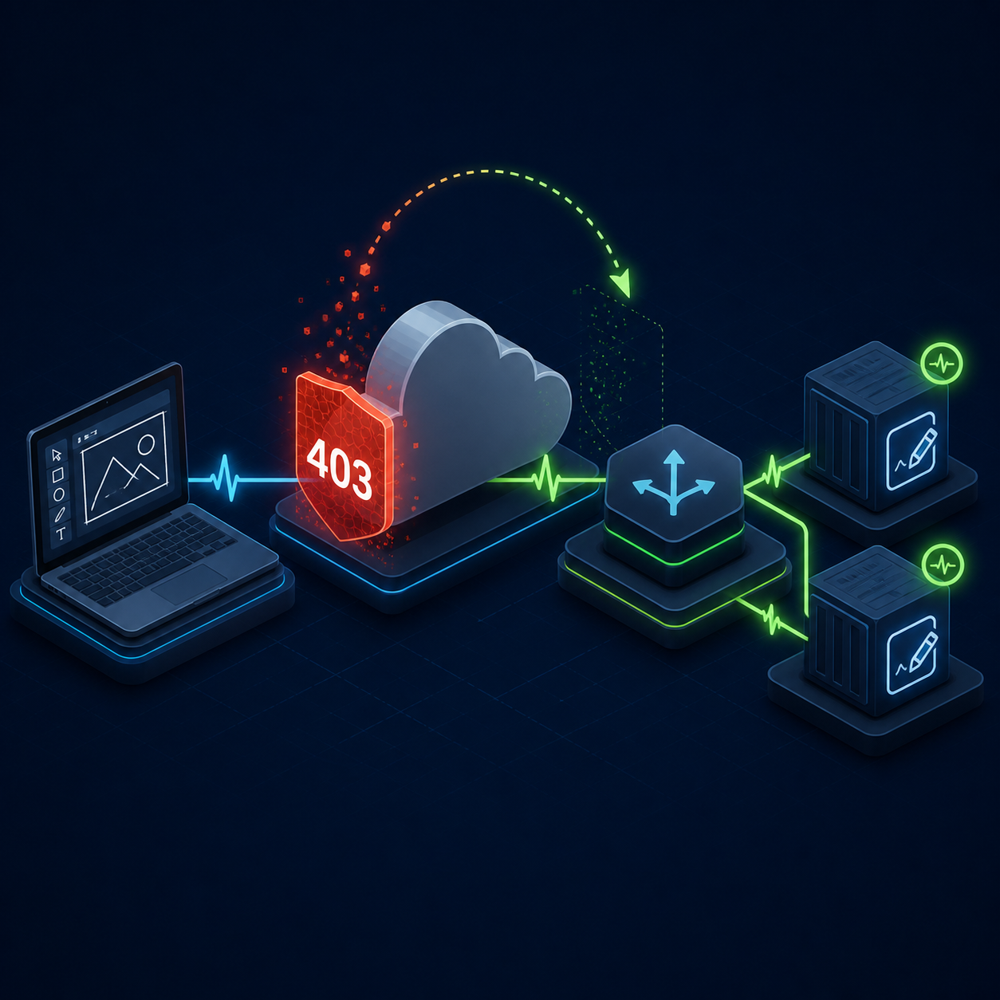

# 0007 — draw.beenex.org briefly returned an upstream 403

**Date:** 2026-09-01

**Service:** ExcaliDash on Coolify  
**Status:** Resolved

## What happened

At approximately 20:03 EDT, a browser request to `draw.beenex.org` returned HTTP 403 with an access-denied page. The application had been working minutes earlier and the same public URL recovered by the time the incident was investigated.

The 403 did not come from the ExcaliDash application. Its frontend and backend containers had been running continuously since June 21, remained healthy, and did not restart during the incident. The frontend's internal health check returned HTTP 200 every 30 seconds throughout the window. There was also no deployment, container start, container stop, OOM event, or Traefik restart around the failure.

The failed browser navigation did not appear in the application access log, which means it was rejected before reaching the frontend. Requests through the same public hostname reached the application again one minute later. The evidence therefore isolates the incident to a transient denial in the upstream Cloudflare/edge-to-Traefik path, not a Coolify or application outage. The historical Cloudflare security event was not available without an authenticated dashboard session, so the exact edge rule or request classification could not be recovered from the origin logs.

## What I did to fix it

The upstream denial cleared before any service restart or configuration change was necessary. I avoided restarting the healthy application and instead verified every layer independently:

- Coolify reported the application as `running:healthy` on the intended Lenovo server.
- The frontend and backend containers were healthy and had not restarted.
- The frontend served HTTP 200 directly inside its container.
- The backend health endpoint returned HTTP 200 directly inside its container.
- Traefik served the hostname directly at the origin with HTTP 200.
- The public root page, JavaScript bundle, and authentication-status API all returned HTTP 200 through Cloudflare.
- Five consecutive public root requests returned HTTP 200.

No mutation was made to the application, proxy, DNS, or Cloudflare configuration because the live configuration was healthy and changing it would not address the unobserved transient block.

## What should prevent it next time

- Retain Cloudflare security-event logs long enough to identify the exact rule, action, source, and Ray ID after a brief 403.
- Enable bounded Traefik access logging so an origin-generated denial can be distinguished immediately from an edge-generated denial.
- Add an external uptime check that records response status and key headers for `draw.beenex.org`; alert on repeated 403 responses instead of reacting to a single short-lived denial.
- Preserve the existing container health checks so application availability remains independently observable during an edge incident.
- Capture the response headers or Cloudflare Ray ID if the access-denied page appears again.

— Codex, 2026-09-01
